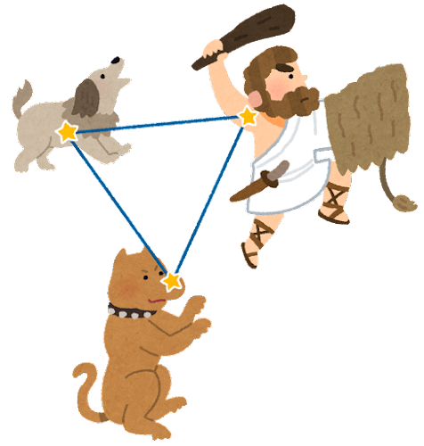

##  やまびこ通信2023年1月号

No.182

2023年1月13日発行

あけましておめでとうございます

{: .naka}

本年も利用者のお役に 立てるよう研鑽を積み、楽しく音訳をいたしましょう。

###  12月の活動報告

{: .migi}

12月1日（木）・8日（木）音訳フォローアップ講座

12月9日（金）定例会・勉強会

12月15日（木）音訳フォローアップ講座

12月23日（金）定例会・勉強会

12月23日（金）12時10分 役員会

###  1月の活動予定

1月8日（日）ユニバーサル部会

1月13日（金）定例会・勉強会

1月27日（金）定例会・勉強会

1月27日（金）東京音訳グループ連絡会講習会「利用者にとって ストレスなく、 意味が通じる読み」

###  今後の予定

2月5日（日）ユニバーサル部会

2月12日（日）バリアフリー映画会 詳細は北区ニュース

###  録音図書 （デイジー版CD） 製作

{: .migi}

北区図書館情報12月 及び北区の部屋だより 第160号  
55分

扉 第20回 内田康夫ミステリー文学賞受賞作品  
4時間50分

北視協通信 第5号 通巻277号12分（CD 22枚）

令和4年 北区文化芸術祭 俳句大会1時間45分（CD 7枚）

隠された十字架：法隆寺論  
18時間（CD 1枚）

日本人にとって干支とは何か  
7時間5分（CD 1枚）

###  対面音訳

12月|20時間
|:---|---:|
今年度累計|609時間

###  十条台句会

<ruby>息白<rp>(</rp><rt>いきしろ</rt><rp>)</rp></ruby>し ミルクのボタン<ruby>押<rp>(</rp><rt>お</rt><rp>)</rp></ruby>すコーヒー
<ruby>真貴<rp>(</rp><rt>まき</rt><rp>)</rp></ruby>

###  おめでたいお知らせ

{: .migi}

令和4年 北区文化芸術祭 俳句大会（北区俳句連盟）にて、鈴木幹雄さまが

{: .migi}

「<ruby>枯葉<rp>(</rp><rt>かれは</rt><rp>)</rp></ruby>ふむ <ruby>一歩一歩<rp>(</rp><rt>いっぽいっぽ</rt><rp>)</rp></ruby>の <ruby>音<rp>(</rp><rt>おと</rt><rp>)</rp></ruby> うれし」

の作品で、「北区俳句連盟賞」を受賞なさいました。おめでとうございます。

鈴木さまは、十条台句会に入会なさって6年、やまびこ通信でお目にかかる時の俳号は <ruby>幹雄<rp>(</rp><rt>かんゆう</rt><rp>)</rp></ruby>さんです。

月に1回ほど山行し、その時に感じたことなどを、お帰りになってから思い浮かべて俳句の中に込めていらっしゃるそうです。

###  やまびこ通信と十条台句会

2017年4月号より、やまびこ通信 紙面を、十条台句会の作句の発表の場としてのご提供を始めました。当時は句会に所属する やまびこの会員や、 利用者の方もいらしたそうです。

折々の句を紹介するコーナーを「ほっと一句」とのタイトルで掲載いたしました。

現在は「十条台句会より」のタイトルで通信に掲載され、毎月１句発表されています。

十条台句会のご様子を 鈴木さまにお伺いしました。

句会は、年に2回程度なさっていたようですが、この3年間は、岩佐真貴会長から兼題をメールで配信され、会員は作句し 返信、会長が作品を纏め 送信、会員は3句を選び返信、会長は選ばれた作品とその講評を 会員に配信する手順で、すべてメールでのやり取りと伺いました。

###  Let&apos;s try!

{: .migi}

####  2023年1月の問題

読んでみましょう！

<blockquote markdown="1">

(1) 玉川上水の<ruby>辺<rp>(</rp><rt>（　　　）</rt><rp>)</rp></ruby>り、<ruby>終<rp>(</rp><rt>（　　　）</rt><rp>)</rp></ruby>の<ruby>棲家<rp>(</rp><rt>（　　　）</rt><rp>)</rp></ruby>

(2) 40年という時間を<ruby>閲<rp>(</rp><rt>（　　　）</rt><rp>)</rp></ruby>している

(3) <ruby>熾火<rp>(</rp><rt>（　　　）</rt><rp>)</rp></ruby>のように残った

(4) 相次いで<ruby>喪<rp>(</rp><rt>（　　　）</rt><rp>)</rp></ruby>った

(5) 彼と<ruby>思<rp>(</rp><rt>（　　　）</rt><rp>)</rp></ruby>しき人、<ruby>蔑<rp>(</rp><rt>（　　　）</rt><rp>)</rp></ruby>まれ・<ruby>絨毯<rp>(</rp><rt>（　　　）</rt><rp>)</rp></ruby>

(6) <ruby>伽羅<rp>(</rp><rt>（　　　）</rt><rp>)</rp></ruby>を<ruby>焚<rp>(</rp><rt>（　　　）</rt><rp>)</rp></ruby>いた

(7) 時空の<ruby>束<rp>(</rp><rt>（　　　）</rt><rp>)</rp></ruby>の<ruby>間<rp>(</rp><rt>（　　　）</rt><rp>)</rp></ruby>の<ruby>偸<rp>(</rp><rt>（　　　）</rt><rp>)</rp></ruby>みか

(8) 古ゲノム学を<ruby>拓<rp>(</rp><rt>（　　　）</rt><rp>)</rp></ruby>いたペーポ氏

(9) <ruby>凍<rp>(</rp><rt>（　　　）</rt><rp>)</rp></ruby>てつく古代人

(10) <ruby>靄<rp>(</rp><rt>（　　　）</rt><rp>)</rp></ruby>の中

(11) 筆者 <ruby>渾身<rp>(</rp><rt>（　　　）</rt><rp>)</rp></ruby>の一冊

</blockquote>

問題のいくつかは<ruby>平櫛田中<rp>(</rp><rt>ひらくし</rt><rp>)</rp></ruby>に関する本です。小平市に彫刻美術館があります。

（読売新聞2022年12月11日書評よりルビのあった漢字から）

####  12月の解答

<blockquote markdown="1">

(1) <ruby>恭<rp>(</rp><rt>うやうや</rt><rp>)</rp></ruby>しい

(2) <ruby>逆上<rp>(</rp><rt>のぼ</rt><rp>)</rp></ruby>せる

(3) <ruby>四代目<rp>(</rp><rt>よだいめ</rt><rp>)</rp></ruby>

(4) <ruby>酸<rp>(</rp><rt>す</rt><rp>)</rp></ruby>い

(5) <ruby>二十歳<rp>(</rp><rt>はたち</rt><rp>)</rp></ruby>

(6) <ruby>20歳<rp>(</rp><rt>にじゅっさい</rt><rp>)</rp></ruby>

(7) <ruby>百会<rp>(</rp><rt>ひゃくえ</rt><rp>)</rp></ruby>

(8) <ruby>芳<rp>(</rp><rt>かんば</rt><rp>)</rp></ruby>しい

(9) <ruby>重五<rp>(</rp><rt>ちょうご</rt><rp>)</rp></ruby>（端午の節句）

(10) <ruby>時化<rp>(</rp><rt>しけ</rt><rp>)</rp></ruby>

</blockquote>

定例会: 第2・第4金曜日10時～12時／北区立中央図書館3階

連絡先: 音訳グループやまびこ代表 大川薫

電話番号: 03-3910-7331

<a href="mailto:ymbk2016ml@gmail.com?Subject=やまびこウェブサイトについて" data-dur="5.930" data-begin="401.569" id="xmri_008B" markdown="1">このサイトについてはこちらへ</a>

