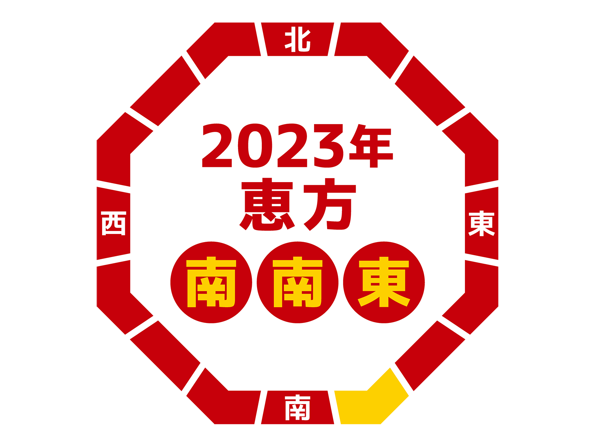

##  やまびこ通信2023年2月号

No.183

2023年2月10日発行

{: .migi}

###  1月の活動報告

1月8日（日） ユニバーサル部会

1月13日（金） 定例会・勉強会

1月27日（金） 定例会・勉強会

1月27日（金） 東京音訳グループ連絡会 講習会

「利用者にとってストレスなく、意味が通じる読み」

###  2月の活動予定

{: .migi}

2月5日（日） ユニバーサル部会

2月10日（金） 定例会・勉強会

2月12日（日） バリアフリー映画会

「ハンサム☆スーツ」午前 10:00 ～ 12:30・午後 2:00 ～ 4:30

2月24日（金） 定例会・勉強会

午後から ユニバーサル部 展示準備

###  今後の予定

3月12日（日） バリアフリー朗読会

午前 10:00 ～ 12：00・午後 2:00 ～ 4:00

・「回転晩餐会」（<ruby>一穂<rp>(</rp><rt>いちほ</rt><rp>)</rp></ruby>ミチ 著）

・「無垢なるものに飢えている」（ロマン・ギャリ 著、 <ruby>須藤<rp>(</rp><rt>すどう</rt><rp>)</rp></ruby><ruby>哲生<rp>(</rp><rt>てつお</rt><rp>)</rp></ruby> 訳）

・「虹の空」（<ruby>藤沢<rp>(</rp><rt>ふじさわ</rt><rp>)</rp></ruby><ruby>周平<rp>(</rp><rt>しゅうへい</rt><rp>)</rp></ruby> 著）

###  録音図書 （デイジー版CD） 製作

{: .migi}

1. 2023 択一六法 民事訴訟法ワードファイル化（約650ページ）

2. 択一六法 憲法ワードファイル化（約650ページ）

3. 北区 くらしのガイド 令和4・ 5年度版  
15時間40分

4. 基幹センターだよりVol.8  
17分

5. 北区図書館情報2023年1月 及び北区の部屋だより第161号  
1時間

6. バネジョのお嬢様が焼くパンケーキは謎の香り 2  
6時間30分

7. 須美ちゃんは名探偵⁉ 浅見光彦シリーズ 番外  
9時間16分

8. LOVE LIVE LEAD（中学生）  
4時間30分

9. <ruby>黒石<rp>(</rp><rt>へいし</rt><rp>)</rp></ruby> 新宿鮫 XII  
17時間

###  対面音訳

1月|35時間
|:---|---:|
今年度累計|644時間

###  十条台句会より

{: .migi}

<ruby>水仙<rp>(</rp><rt>すいせん</rt><rp>)</rp></ruby>を <ruby>活<rp>(</rp><rt>い</rt><rp>)</rp></ruby>けて<ruby>心<rp>(</rp><rt>こころ</rt><rp>)</rp></ruby>の<ruby>引<rp>(</rp><rt>ひ</rt><rp>)</rp></ruby>き<ruby>締<rp>(</rp><rt>し</rt><rp>)</rp></ruby>まり
<ruby>清子<rp>(</rp><rt>きよこ</rt><rp>)</rp></ruby>

###  Let&apos;s try!

{: .migi}

####  2月 読んでみましょう！

<blockquote markdown="1">

（1） <ruby>過<rp>(</rp><rt>（　　　）</rt><rp>)</rp></ruby>る

（2） <ruby>詳<rp>(</rp><rt>（　　　）</rt><rp>)</rp></ruby>らか

（3） <ruby>象<rp>(</rp><rt>（　　　）</rt><rp>)</rp></ruby>る

（4）<ruby> 況<rp>(</rp><rt>（　　　）</rt><rp>)</rp></ruby>や

（5） <ruby>薬研<rp>(</rp><rt>（　　　）</rt><rp>)</rp></ruby>

（6）<ruby>検<rp>(</rp><rt>（　　　）</rt><rp>)</rp></ruby>める

（7） <ruby>戦<rp>(</rp><rt>（　　　）</rt><rp>)</rp></ruby>く

（8） <ruby>適<rp>(</rp><rt>（　　　）</rt><rp>)</rp></ruby>う

（9） <ruby>続柄<rp>(</rp><rt>（　　　）</rt><rp>)</rp></ruby>

（10） <ruby>約束<rp>(</rp><rt>（　　　）</rt><rp>)</rp></ruby>を<ruby>違<rp>(</rp><rt>（　　　）</rt><rp>)</rp></ruby>える

 (11) ノルマを<ruby>熟<rp>(</rp><rt>（　　　）</rt><rp>)</rp></ruby>す

 (12) 解決の<ruby>緒<rp>(</rp><rt>（　　　）</rt><rp>)</rp></ruby>

</blockquote>

####  1月の解答

<blockquote markdown="1">

(1) 玉川上水の<ruby>辺<rp>(</rp><rt>ほと</rt><rp>)</rp></ruby>り、<ruby>終<rp>(</rp><rt>つい</rt><rp>)</rp></ruby>の<ruby>棲<rp>(</rp><rt>すみか</rt><rp>)</rp></ruby>

(2) 40年という時間を<ruby>閲<rp>(</rp><rt>けみ</rt><rp>)</rp></ruby>している

(3) <ruby>熾火<rp>(</rp><rt>おきび</rt><rp>)</rp></ruby>のように残った

(4) 相次いで<ruby>喪<rp>(</rp><rt>うしな</rt><rp>)</rp></ruby>った

(5) 彼と<ruby>思<rp>(</rp><rt>おぼ</rt><rp>)</rp></ruby>しき人、<ruby>蔑<rp>(</rp><rt>さげす</rt><rp>)</rp></ruby>まれ・<ruby>絨毯<rp>(</rp><rt>じゅうたん</rt><rp>)</rp></ruby>

(6) <ruby>伽羅<rp>(</rp><rt>きゃら</rt><rp>)</rp></ruby>を<ruby>焚<rp>(</rp><rt>た</rt><rp>)</rp></ruby>いた

(7) 時空の<ruby>束<rp>(</rp><rt>つか</rt><rp>)</rp></ruby>の<ruby>間<rp>(</rp><rt>ま</rt><rp>)</rp></ruby>の<ruby>偸<rp>(</rp><rt>ぬす</rt><rp>)</rp></ruby>みか

(8) 古ゲノム学を<ruby>拓<rp>(</rp><rt>ひら</rt><rp>)</rp></ruby>いたペーポ氏

(9) <ruby>凍<rp>(</rp><rt>い</rt><rp>)</rp></ruby>てつく古代人

(10) <ruby>靄<rp>(</rp><rt>もや</rt><rp>)</rp></ruby>の中

(11) 筆者 <ruby>渾身<rp>(</rp><rt>こんしん</rt><rp>)</rp></ruby>の一冊

(12) 問題のいくつかは<ruby>平櫛<rp>(</rp><rt>ひらくし</rt><rp>)</rp></ruby><ruby>田中<rp>(</rp><rt>でんちゅう</rt><rp>)</rp></ruby>に関する本です。小平市に彫刻美術館があります。

</blockquote>

定例会: 第2・第4金曜日10時～12時／北区立中央図書館3階

連絡先: 音訳グループやまびこ代表 大川薫

電話番号: 03-3910-7331

<a href="mailto:ymbk2016ml@gmail.com?Subject=やまびこウェブサイトについて" data-dur="5.930" data-begin="304.353" id="xmri_0082" markdown="1">このサイトについてはこちらへ</a>

